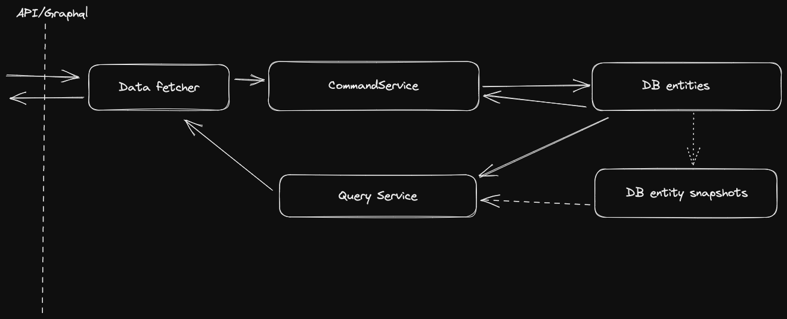
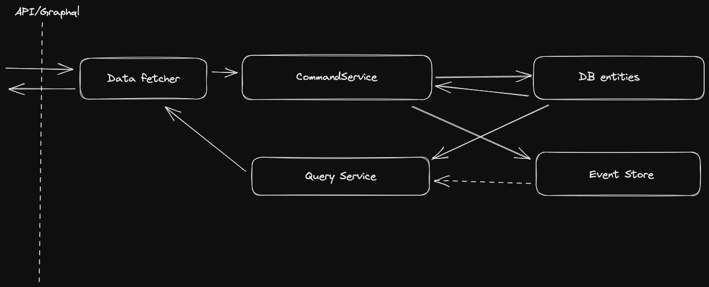
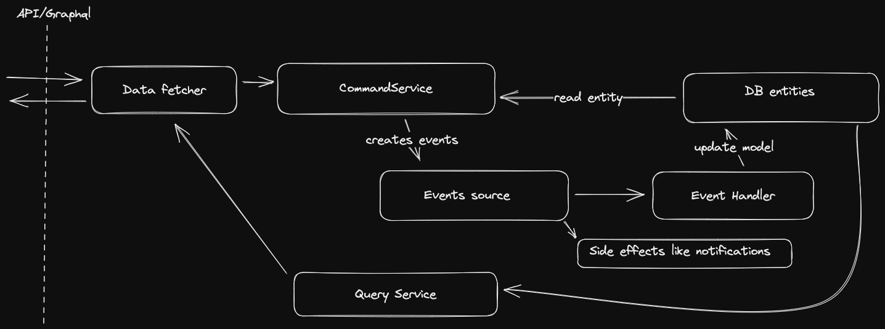
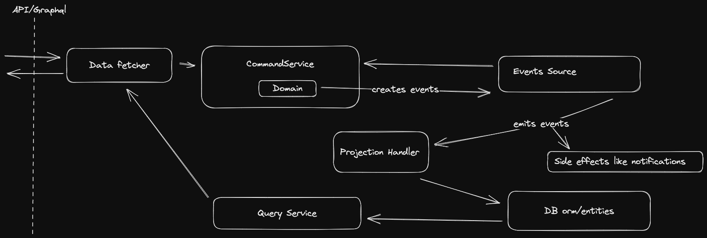

# CRUD + AUDIT LOG 

branch: see rome

- nothing to do, we are already there
- we have it almost for free with `@Audit` annotation
- display who changed field - not performant and really problematic
- changing entities requires a bit overhead. 
- Bigger changes in schema will break audit log or will require us to migrate as well
- Not exactly easy to read changelog. Timeline with only new values easy. showing diff will require some hacking to find previous value 

# CRUD + Event store

branch: events-sideeffect

- easy to implement 
- nothing really breaks loose when we fuck up or decide to change schema
- store what we want to display on timeline
- can work with audit snapshots - audit will be for us. Maybe we could use at some point as true snapshot view from past on FE
- we cant do event sourcing by replaying events - we could ensure it's possible with tests but at this point we have a lot of overhead without benefit. 
- no CV-driven-development 😏 

# CQS-ES(?)

branch: event-sourcing-on-entity

- we trust events, everything happens via events
- possibly used in conjunction with audit log
- we could reply everything if we really need it
- we don't need domain we can use the same model everywhere
- graphql schema reflect 1-to-1 our db schema
- we need to do extra tests (if we want to be sure we can replay events)
- logic is smeared across codebase

- 

# CQRS-DDD-ES

branch: cqrs-ddd-es

- a lot of boilerplate
- events are true source - however we store them we always need to be able to read them
- we could drop whole query layer and redo it from events
- we can optimize query layer for queries - tho we probably will keep it the same cause big graph 😅
- designing domain is hard. At this point everything happens in workspace cause this is the only place that keeps model in sync. I've no idea how to split it wisely to separate event stream.
- we should change the way we communicate - we should think in terms of processes not field value changes.
- if our query model is ~equal to domain model then we should ask ourselves why we do this
- plenty of nice concepts to play with
- postgres is not exactly the best to store them - nosql would be nicer, maybe some event db

